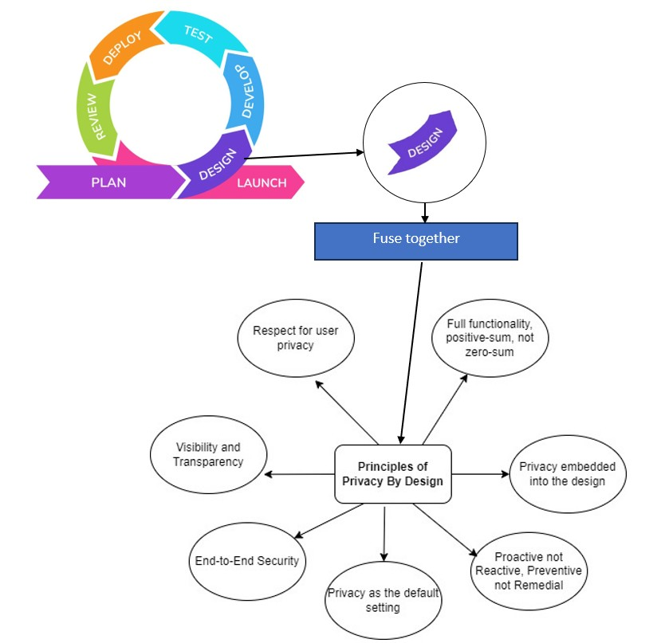

    Team

Thirilok 47990627
Amita 48103527
Ruhul 47853298
Sahan 48091472

Instagram's Software Development Lifecycle (SDLC) Approach

While Instagram's exact SDLC methodologies are proprietary, industry
analysis suggests a hybrid framework combining Agile (for iterative
feature development), DevOps (for rapid deployment), and iterative
refinement. Unlike rigid models like Waterfall (linear phases) or Big
Bang (all-at-once deployment), Instagram prioritizes flexibility to
adapt to trends (e.g., Reels to compete with TikTok) while scaling for
billions of users.

Our Goal: Building a **Privacy-Centric** Framework for developing social
media systems;

Most social media companies and startups prioritize user growth and
monetization, giving less focus on privacy, often addressing
vulnerabilities only after breaches (e.g., Optus cyberattack exposed
9.8M customers\' data via an insecure API endpoint. Showcased
underinvestment in cybersecurity in the beginning). By integrating
Privacy by Design (PbD) into the design stage in SDLC phase, we aim to
create a proactive model where privacy is foundational, not reactive.

1.  We will conduct a literature review on every concept we have learnt
    on privacy in social medias including dataset analysis, and PBD
    requirements and technical tools.

2.  We will analyze a large sample dataset from Instagram, previously
    scraped by open-source contributors, to formulate scenarios and
    identify theoretical privacy concerns. This will help us assess the
    privacy impact on social connectivity, based on a previous unit
    lessonsfrom COMP8320 (Information and Data Security).

3.  Based on the formulated scenarios we will look at how to practically
    apply this privacy by design principles into social media
    information systems.

4.  Next, after everything we research we will create a protype
    showcasing these new and built in privacy applications in our
    Instagram clone using a tech stack described in the scope document.

As for project management tools we will use a online tool called Trello,
to track project and team progress,

In Trello, we will create a board for our project. This board will have
lists that represent different stages of the work, such as \"To Do,\"
\"In Progress,\" and \"Completed."

Version controlling for the prototype will be done by GitHub

Below is the Diagrams for Agile SDLC and PbD 7 Principles for reference,

{width="0.7881824146981627in"
height="0.6976738845144357in"}

Timeline

For the first part, we need to research Privacy by Design (PbD)---who
created it, why it was developed, and its key principles. This will help
us understand how privacy is built into systems from the start, rather
than added later.

Next, we will explore how social media platforms are built by looking at
different software development approaches like the Software Development
Life Cycle (SDLC), Agile, and Waterfall. We will also examine existing
privacy-focused development models and what steps they take in
development lifecycle.

To apply this research, we will conduct a literature review on Instagram
(in which there are billions of users which we take as example), We will
list how Instagram handles privacy, what are those mainly used for, and
what privacy issues have been found in the past and fixed.

Eg :-

> Right now, when you follow a page on Instagram---like a brand,
> celebrity, or political group---other people can see it. This can lead
> to security risks, where scammers or bad actors target you based on
> your follows, sending spam or harassment. It can also cause social
> judgment, where people might criticize or attack you for following
> certain pages, especially controversial ones.
>
> Instagram does not currently let users hide or customize who can see
> their follows. If your account is public, anyone can see them. If it's
> private, only your followers can. There's no way to make follows
> completely private or choose specific people who can view them. This
> setup benefits Instagram's business model by increasing engagement and
> improving ads targeting based on what users follow.
>
> A better solution would be to introduce a follow privacy setting,
> allowing users to control who sees their follows. Options could be
> public, only to mutual followers, completely private, or by choice of
> selected people. This respects user privacy but doesn't help the
> business model.
>
> (this feature is already in other Major social media applications like
> Facebook (which is heavy on privacy)
>
> The solution is already there and fixed but not just implemented on
> Instagram to support the huge business model Instagram uses to
> monetize.

Software engineers make software thinking of a great innovative idea
such as a new feature like AI driven Avatars, stickers, personalized
interactions, but they do not think about the privacy aspects (they want
to have the best functionality), they think the quality assurance guy or
tester guy who handles privacy will check it. In order to find the best
scenarios and theories we have to analyse a dataset,

Next, we can gather a sample dataset, we can scrape the public data that
is available to everyone online in Instagram, using tools like python
and https combined with beautifulsoup but we wouldn't do that , we can
credit other peoples work by downloading an already scraped instagram
dataset from github and opensource contributors and crediting their
work.

From this dataset, we need to analyse the attributes/fields mainly that
give use any of the following.

1.  Direct Identifier - A piece of data that uniquely identifies an
    individual

2.  High Sensitivity - Data that, if exposed, could cause significant
    harm

3.  **Quasi-Identifier** - Attributes that, when combined, can
    re-identify individuals

4.  Sensitive Attribute - Data that reveals private or personal
    information

5.  **Indirect Identifier** - Data that can be used to infer identity
    through linkage or analysis

For example here are the attributes in the dataset,

account, biography, business_address_json, business_category_name,
business_email, external_url, fbid, followers, following, highlights,
id, is_business_account, is_professional_account, is_verified, posts,
posts_count, profile_image_link, profile_name, timestamp,
highlights_count, country_code, region, avg_engagement, post_hashtags,
maybe_country_codes, bio_hashtags, avatar_cached, category_enum,
category_name, changelog, full_name, is_private

here are some examples,

| Attributes            | Risk Category       | Reason                                                             |
| --------------------- | ------------------- | ------------------------------------------------------------------ |
| account, fbid         | Direct Identifier   | Uniquely identifies an individual                                  |
| business_address_json | High Sensitivity    | Physical address poses privacy and safety risks.                   |
| business_email        | Direct Identifier   | Directly identifies a person or business.                          |
| profile_name          | Quasi-Identifier    | Could be combined with other attributes for re-identification.     |
| country_code, region  | Quasi-Identifier    | Geolocation narrows down identity when combined with other data.   |
| followers, posts      | Quasi-Identifier    | High follower counts or post activity may be rare and identifiable |
| profile_image_link    | Indirect Identifier | Reverse image search could reveal identity.                        |
|                       |                     |                                                                    |

After this stage next is how can we practically apply this theories by
using the foundational principles of privacy by design,

Design Phase Approach by PbD in the SDLC --

1.  **Design** Architecture & Prototype

In this Phase we define the design, we don't implement them yet, only
working out the methods.

PbD Integration

Principle 1 (Proactive):

Automated Code Scans:

- Use detect-secrets in pre-commit hooks to block API keys/passwords
  from being saved in Git. (If git is used as our project
  management/repository)

- Use OWASP ZAP or Burp Suite to simulate attacks (e.g., brute-forcing
  /api/login).

Principle 2 (Privacy by Default) Minimize Data Collection

EXIF Metadata Removal:

- Use Next.js API routes to strip GPS/location data from images before
  upload (e.g., sharp library).

- Auto-Delete Stories: Stories auto-delete after 24 hours by default
  Configure AWS S3 to delete Stories after 24 hours (default setting).

Principle 3 (Embedded Privacy)

Pseudonymization:

- Replace IPs/user IDs in logs with hashes using Django-Anonymizer.

- Face Blurring: Integrate AWS Rekognition to blur unrecognized faces in
  public posts (user-enabled).

Principle 4 (Full Functionality):

Privacy doesn't mean it should have Broken Features,

Principle 5 (End-to-End Security)

Encryption Everywhere:

Encrypt media at rest (AWS S3 AES-256) and in transit (TLS 1.3).

Use Django-Fernet to encrypt sensitive fields (emails, phone numbers).

Principle 6 (Transparency):

Privacy Dashboard:

Build a /privacy page showing audit logs using django-auditlog

Audit Log Testing:

Verify django-auditlog tracks user actions (e.g., profile edits, consent
changes).

Principle 7 (Respect User Privacy)

Auto-Delete Inactive Accounts:

Run cron jobs to purge unused accounts after 1 year (Django management
commands).

Rate Limiting:

Block brute-force attacks with Django-Ratelimit (e.g., 5 login
attempts/minute).

.

Contribution 
+--------+------------------+------------------------------------------+
| Name   | Data & Time      | Work done                                |
+========+==================+==========================================+
| Amita  | Wednesday -      | [[Instagram Profiles & Posts & Comments  |
|        | 11:00 am         | DatasetsData                             |
|        |                  | brickshttps://marketplace.databricks.com |
|        |                  | › details ›                              |
|        |                  | Br                                       |
|        |                  | ight-Da...]{.underline}](https://marketp |
|        |                  | lace.databricks.com/details/ae1d1570-e43 |
|        |                  | 5-4640-ab93-f294b9ae604c/Bright-Data_Ins |
|        |                  | tagram-Profiles-Posts-Comments-Datasets) |
|        |                  |                                          |
|        |                  | Find out the dataset. Tried to download  |
|        |                  | the Instagram public page data.          |
|        |                  |                                          |
|        |                  | Here is another dataset I found on       |
|        |                  | GitHub.                                  |
|        |                  |                                          |
|        |                  | [[Dat                                    |
|        |                  | aset]{.underline}](https://docs.google.c |
|        |                  | om/spreadsheets/d/16O5rHiiYqPb39l214CvOf |
|        |                  | 1jiwS2EEAXqgzHXGH-8VNE/edit?usp=sharing) |
+--------+------------------+------------------------------------------+
| Th     | 28/03            | Searched for publicly available dataset  |
| irilok | (Thursday) - 3pm |                                          |
+--------+------------------+------------------------------------------+
| Th     | 29/03 (Friday) - | Developed a Python script and created a  |
| irilok | 10am             | new Instagram account in order to fetch  |
|        |                  | the publicly available data. I used the  |
|        |                  | Selenium-Firefox combination to create a |
|        |                  | scraper, but unfortunately, it prints    |
|        |                  | only a few users names, not the entire   |
|        |                  | list.                                    |
+--------+------------------+------------------------------------------+
| Th     | 03/04            | Got dataset from the available public    |
| irilok | (Thursday) - 5pm | profile and gave to the team for further |
|        |                  | analysis                                 |
+--------+------------------+------------------------------------------+
| Th     | Wednesday,       | Got a datas of users in JSON files with  |
| irilok | 8:30am           | their Name, bio, number of posts, posts  |
|        |                  | related information, follower and        |
|        |                  | folllowing count.                        |
|        |                  |                                          |
|        |                  | [[                                       |
|        |                  | https://data.world/prsr/instagram-profil |
|        |                  | es/workspace/file?filename=instagram_pro |
|        |                  | files.tar.gz]{.underline}](https://data. |
|        |                  | world/prsr/instagram-profiles/workspace/ |
|        |                  | file?filename=instagram_profiles.tar.gz) |
+--------+------------------+------------------------------------------+
| Amita  | Saturday 10:00   | Searching for the required script/API    |
|        | pm               | for fetching the data from the datasets. |
+--------+------------------+------------------------------------------+
| Maruf  | Tuesday 7.00pm   | Created a separate Instagram account for |
|        |                  | scraping.                                |
+--------+------------------+------------------------------------------+
| Maruf  | Tuesday 8.00pm   | Set up the Instagram Graph API to get    |
|        |                  | the API keys and secrets necessary for   |
|        |                  | Sahan to make the scraper.               |
+--------+------------------+------------------------------------------+
| Maruf  | Wednesday 9 00am | Updated document in the project uploaded |
|        |                  | in github                                |
|        |                  | [[https://github.com/Sahan               |
|        |                  | Chan/intagramScraper]{.underline}](https |
|        |                  | ://github.com/SahanChan/intagramScraper) |
+--------+------------------+------------------------------------------+
| Sahan  | Wednesday 6 00am | Analysed what thirilok and amita         |
|        |                  | provided for the dataset analysis.       |
|        |                  | Rewrote the scope document necessary.    |
+--------+------------------+------------------------------------------+
| Sahan  | Wednesday 6 30am | Researched how to make a scraper using   |
|        |                  | python and insta graph api (which Maruf  |
|        |                  | provided). And make a simple scraper.    |
+--------+------------------+------------------------------------------+
| Sahan  | Wednesday 8 30   | Later uploaded the code and scope        |
|        | am               | document to github, here is the link,    |
|        |                  |                                          |
|        |                  | [[https://github.com/Sahan               |
|        |                  | Chan/intagramScraper]{.underline}](https |
|        |                  | ://github.com/SahanChan/intagramScraper) |
+--------+------------------+------------------------------------------+
| Amita  | Wednesday 9:02   | Analysed the code and scraped data added |
|        | am               | in the github.                           |
+--------+------------------+------------------------------------------+
